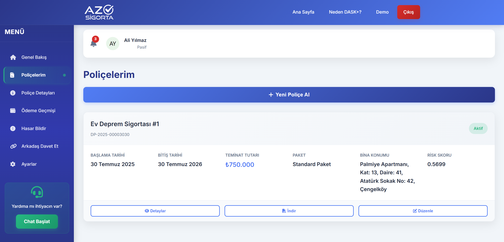
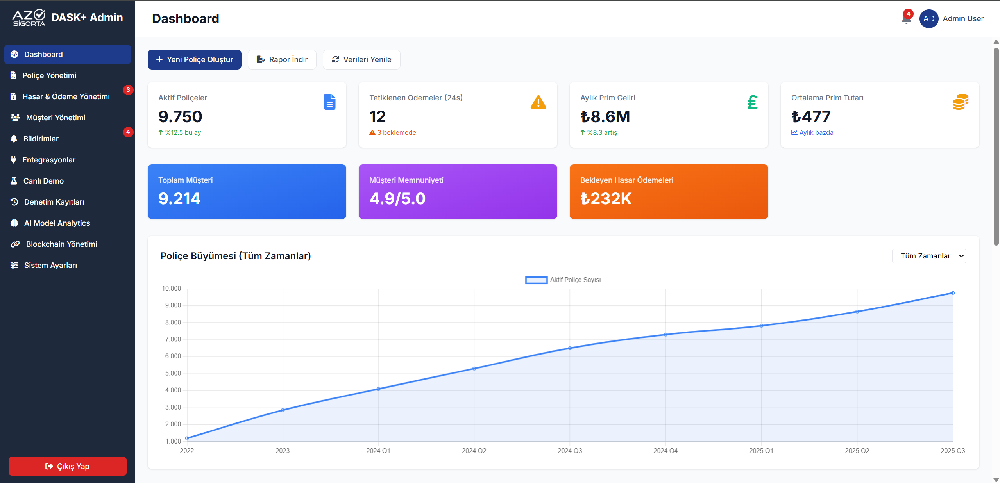

# 🏠 DASK+ Parametrik Sigorta Sistemi

[](https://www.python.org/)
[](https://flask.palletsprojects.com/)
[](LICENSE)
[](src/app.py)
[](src/blockchain_service.py)

**Türkiye'nin ilk yapay zeka destekli parametrik deprem sigortası sistemi**

[🇹🇷 Türkçe](#-türkçe) | [🇬🇧 English](#-english)

---

## 🇹🇷 Türkçe

### 📋 Genel Bakış

**DASK+ Parametrik**, geleneksel DASK sigortasına modern bir alternatif sunarak, deprem sonrası hızlı ödeme garantisi sağlayan akıllı sigorta platformudur.

#### 🎯 Ana Özellikler

- ⚡ **Hızlı Ödeme:** Deprem sonrası 72 saat içinde otomatik ödeme
- 🤖 **Yapay Zeka:** Machine Learning bazlı risk analizi ve dinamik fiyatlandırma
- 🔗 **Blockchain:** Şeffaf ve değiştirilemez kayıt sistemi
- 📊 **Gerçek Zamanlı Veri:** Kandilli Rasathanesi canlı deprem verisi
- 🎯 **Parametrik Tetikleme:** PGA/PGV eşik değerleri ile otomatik ödeme
- 💰 **Esnek Paketler:** 250K - 1.5M TL arası teminat seçenekleri
- 📍 **Hassas Lokasyon:** Mahalle bazında detaylı risk analizi
- 👥 **Multi-Admin Sistem:** 2-of-3 blockchain onay mekanizması

### 🚀 Hızlı Başlangıç

#### Gereksinimler

- Python 3.8 veya üzeri
- pip (Python paket yöneticisi)
- 4GB+ RAM
- Windows/Linux/macOS

#### Kurulum

```powershell
# 1. Repository'yi klonlayın
git clone https://github.com/erd0gan/dask-plus-parametric.git
cd dask-plus-parametric

# 2. Virtual environment oluşturun
python -m venv venv

# Windows
.\venv\Scripts\activate

# Linux/Mac
source venv/bin/activate

# 3. Bağımlılıkları yükleyin
pip install -r requirements.txt

# 4. Uygulamayı başlatın
python run.py
```

#### İlk Çalıştırma

Uygulama ilk çalıştırmada otomatik olarak:
- ✅ `data/` klasörünü oluşturur
- ✅ 10,000 gerçekçi bina/müşteri verisi üretir
- ✅ Blockchain sistemini başlatır
- ✅ AI modellerini hazırlar
- ✅ Kandilli servisini aktifleştirir

```
================================================================================
🚀 DASK+ PARAMETRIK SIGORTA BACKEND
================================================================================
✅ Blockchain Service hazır (Immutable Hash-Chained Blockchain)
✅ Blockchain Manager hazır (Hibrit Mod)
✅ Kandilli Service hazır
📊 Bina verisi oluşturuluyor...
✅ 10000 bina ve müşteri verisi oluşturuldu
✅ Pricing System hazır
✅ Earthquake Analyzer hazır
✅ Building Loader hazır
✅ Trigger Engine hazır
================================================================================
✅ BACKEND BAŞLATILDI!
================================================================================
📍 Ana Sayfa: http://localhost:5000
📍 Admin Panel: http://localhost:5000/admin
💡 Çıkmak için: CTRL+C
```

### 🌐 Web Arayüzü

Uygulama başlatıldıktan sonra tarayıcınızda:

- **🏠 Ana Sayfa:** http://localhost:5000
- **👤 Müşteri Paneli:** http://localhost:5000/dashboard
- **⚙️ Admin Panel:** http://localhost:5000/admin

#### Demo Giriş Bilgileri

```
E-mail: demo@daskplus.com.tr
Şifre: dask2024
```

### 📸 Ekran Görüntüleri

#### Ana Sayfa

*Modern ve kullanıcı dostu ana sayfa arayüzü*

#### Müşteri Dashboard

*Müşteri paneli - Poliçe bilgileri, deprem verileri ve risk analizi*

#### Admin Panel

*Admin paneli - Poliçe yönetimi, blockchain istatistikleri ve sistem kontrolü*

### 📁 Proje Yapısı

```
UI-Latest/
│
├── run.py                         # 🚀 Ana giriş noktası
├── README.md                      # 📖 Bu dosya
├── LICENSE                        # 📄 MIT Lisans
├── requirements.txt               # 📦 Python bağımlılıkları
│
├── src/                          # 💻 Backend kaynak kodları
│   ├── app.py                    # Flask API & Routes
│   ├── auth.py                   # Kimlik doğrulama & JWT
│   ├── pricing.py                # AI fiyatlandırma sistemi
│   ├── trigger.py                # Parametrik trigger engine
│   ├── generator.py              # Veri üretici
│   ├── blockchain_manager.py     # Blockchain manager (hibrit)
│   ├── blockchain_service.py     # Blockchain service (hash-chained)
│   └── dask_plus_simulator.py    # Smart contract simulator
│
├── static/                       # 🎨 Frontend dosyaları
│   ├── index.html                # Ana sayfa
│   ├── dashboard.html            # Müşteri paneli
│   ├── admin.html                # Admin paneli
│   ├── styles.css                # Ana stil dosyası
│   ├── dashboard.css             # Dashboard stilleri
│   └── dashboard.js              # Dashboard JavaScript
│
├── tests/                        # 🧪 Test dosyaları
│   ├── test_api.py               # API testleri
│   ├── test_blockchain.py        # Blockchain testleri
│   └── README.md                 # Test dokümantasyonu
│
├── data/                         # 📊 Veri klasörü (otomatik)
│   ├── buildings.csv             # Bina verisi
│   ├── customers.csv             # Müşteri verisi
│   ├── earthquakes.csv           # Deprem verisi
│   ├── blockchain.dat            # Blockchain kayıtları
│   └── blockchain_policies.json  # Poliçe cache
│
└── docs/                         # 📚 Dokümantasyon
    ├── README.md                 # Detaylı kullanım kılavuzu
    ├── SETUP.md                  # Kurulum rehberi
    ├── CONTRIBUTING.md           # Katkıda bulunma rehberi
    ├── CHANGELOG.md              # Versiyon geçmişi
    └── FINAL_REPORT.md           # Proje raporu
```

### 🛠️ Teknoloji Yığını

#### Backend
- **Flask 3.0.0:** Web framework
- **Pandas/NumPy:** Veri işleme ve analiz
- **Scikit-learn:** Machine learning modelleri
- **Requests:** HTTP client (Kandilli entegrasyonu)
- **Geopy/PyProj:** Coğrafi hesaplamalar
- **PyCryptodome:** AES-256 şifreleme
- **PyJWT:** Token yönetimi

#### Blockchain
- **Hash-Chained Blockchain:** Immutable kayıt sistemi
- **Multi-Admin System:** 2-of-3 onay mekanizması
- **Smart Contract Simulator:** Parametrik trigger logic

#### Frontend
- **HTML5/CSS3:** Modern responsive UI
- **JavaScript (Vanilla):** Dinamik içerik
- **Chart.js:** Grafikler ve istatistikler
- **Leaflet:** Harita görselleştirme
- **Font Awesome:** İkonlar

#### Veri Kaynakları
- **Kandilli Rasathanesi:** Gerçek zamanlı deprem verisi
- **AFAD:** Tarihi deprem kayıtları
- **TÜİK:** Bina istatistikleri

### 💼 Paket ve Fiyatlandırma

| Paket | Teminat | PGA Eşikleri | Ödeme Süresi | Prim Oranı |
|-------|---------|--------------|--------------|------------|
| 🥉 **Temel** | 250,000 TL | 0.10g / 0.20g / 0.35g | 14 gün | %1.0 ± risk |
| 🥈 **Standard** | 750,000 TL | 0.12g / 0.25g / 0.40g | 14 gün | %1.0 ± risk |
| 🥇 **Premium** | 1,500,000 TL | 0.15g / 0.30g / 0.50g | 10 gün | %1.0 ± risk |

#### Risk Faktörleri (8 Parametre)

1. **Bina Yaşı:** 0-80 yıl
2. **Fay Mesafesi:** 0-500 km
3. **Zemin Büyütme:** 1.0-2.5x faktör
4. **Sıvılaşma Riski:** 0-0.8 olasılık
5. **Yapı Kalitesi:** 1-10 skor
6. **Kat Sayısı:** 1-40 kat
7. **Bina Alanı:** 30-2000 m²
8. **Kullanım Tipi:** Konut/Ticari/Karma

### 📊 API Endpoint'leri

#### Deprem Verileri (Gerçek Zamanlı)
```bash
GET /api/earthquakes?min_magnitude=2.0&limit=10
```

#### Prim Hesaplama
```bash
POST /api/calculate-premium
Content-Type: application/json

{
  "il": "İstanbul",
  "ilce": "Kadıköy",
  "mahalle": "Fenerbahçe",
  "package": "temel"
}
```

#### Blockchain İstatistikleri
```bash
GET /api/blockchain/stats
```

#### Blockchain Block'ları Listele
```bash
GET /api/blockchain/blocks?type=policy&limit=50
```

#### Müşteri Blockchain Geçmişi
```bash
GET /api/blockchain/customer/<customer_id>
```

### 🧪 Test Etme

```powershell
# API testleri
python tests/test_api.py

# Blockchain testleri
python tests/test_blockchain.py

# Tüm testler
python -m pytest tests/
```

### 📈 Performans Metrikleri

- **API Yanıt Süresi:** <500ms (ortalama)
- **Kandilli Veri Çekimi:** ~2-3 saniye
- **Prim Hesaplama:** <100ms
- **Veri Üretimi:** 10K bina ~30 saniye
- **Bellek Kullanımı:** ~500MB (backend aktif)
- **Blockchain Block Ekleme:** <50ms

### 🤝 Katkıda Bulunma

Katkılarınızı bekliyoruz! Lütfen [CONTRIBUTING.md](docs/CONTRIBUTING.md) dosyasını okuyun.

1. Fork yapın
2. Feature branch oluşturun (`git checkout -b feature/AmazingFeature`)
3. Commit edin (`git commit -m 'Add some AmazingFeature'`)
4. Push edin (`git push origin feature/AmazingFeature`)
5. Pull Request açın

### 📝 Lisans

Bu proje MIT lisansı altında lisanslanmıştır. Detaylar için [LICENSE](LICENSE) dosyasına bakın.

### 👥 İletişim

**Proje Sahibi:** Burak Erdoğan & Berkehan Arda Özdemir  
**Email:** daskplus@gmail.com  

### 🙏 Teşekkürler

- **Kandilli Rasathanesi (KOERI):** Gerçek zamanlı deprem verisi
- **AFAD:** Deprem veritabanı
- **TÜİK:** İstatistiksel veri
- **Açık Kaynak Topluluk:** Kullanılan tüm kütüphaneler

---

## 🇬🇧 English

### 📋 Overview

**DASK+ Parametric** is an AI-powered parametric earthquake insurance platform that offers a modern alternative to traditional DASK insurance with guaranteed fast payouts after earthquakes.

#### 🎯 Key Features

- ⚡ **Fast Payout:** Automatic payment within 72 hour after earthquake
- 🤖 **Artificial Intelligence:** ML-based risk analysis and dynamic pricing
- 🔗 **Blockchain:** Transparent and immutable record system
- 📊 **Real-Time Data:** Live earthquake data from Kandilli Observatory
- 🎯 **Parametric Trigger:** Automatic payout based on PGA/PGV thresholds
- 💰 **Flexible Packages:** Coverage options from 250K to 1.5M TL
- 📍 **Precise Location:** Detailed neighborhood-level risk analysis
- 👥 **Multi-Admin System:** 2-of-3 blockchain approval mechanism

### 🚀 Quick Start

#### Requirements

- Python 3.8 or higher
- pip (Python package manager)
- 4GB+ RAM
- Windows/Linux/macOS

#### Installation

```bash
# 1. Clone the repository
git clone https://github.com/erd0gan/dask-plus-parametrik.git
cd dask-plus-parametrik

# 2. Create virtual environment
python -m venv venv

# Windows
.\venv\Scripts\activate

# Linux/Mac
source venv/bin/activate

# 3. Install dependencies
pip install -r requirements.txt

# 4. Run the application
python run.py
```

### 🌐 Web Interface

After starting the application, open in your browser:

- **🏠 Home Page:** http://localhost:5000
- **👤 Customer Panel:** http://localhost:5000/dashboard
- **⚙️ Admin Panel:** http://localhost:5000/admin

#### Demo Login Credentials

```
Email: demo@daskplus.com.tr
Password: dask2024
```

### 📸 Screenshots

#### Home Page

*Modern and user-friendly home page interface*

#### Customer Dashboard

*Customer panel - Policy information, earthquake data, and risk analysis*

#### Admin Panel

*Admin panel - Policy management, blockchain statistics, and system control*

### 🛠️ Technology Stack

#### Backend
- **Flask 3.0.0:** Web framework
- **Pandas/NumPy:** Data processing
- **Scikit-learn:** Machine learning
- **Requests:** HTTP client
- **Geopy/PyProj:** Geospatial calculations

#### Blockchain
- **Hash-Chained Blockchain:** Immutable record system
- **Multi-Admin System:** 2-of-3 approval mechanism
- **Smart Contract Simulator:** Parametric trigger logic

#### Frontend
- **HTML5/CSS3:** Modern responsive UI
- **JavaScript:** Dynamic content
- **Chart.js:** Charts and statistics
- **Leaflet:** Map visualization

### 💼 Packages and Pricing

| Package | Coverage | PGA Thresholds | Payout Time | Premium Rate |
|---------|----------|----------------|-------------|--------------|
| 🥉 **Basic** | 250,000 TL | 0.10g / 0.20g / 0.35g | 14 days | 1.0% ± risk |
| 🥈 **Standard** | 750,000 TL | 0.12g / 0.25g / 0.40g | 14 days | 1.0% ± risk |
| 🥇 **Premium** | 1,500,000 TL | 0.15g / 0.30g / 0.50g | 10 days | 1.0% ± risk |

### 🧪 Testing

```bash
# API tests
python tests/test_api.py

# Blockchain tests
python tests/test_blockchain.py

# All tests
python -m pytest tests/
```

### 🤝 Contributing

We welcome contributions! Please read [CONTRIBUTING.md](docs/CONTRIBUTING.md).

1. Fork the project
2. Create your feature branch (`git checkout -b feature/AmazingFeature`)
3. Commit your changes (`git commit -m 'Add some AmazingFeature'`)
4. Push to the branch (`git push origin feature/AmazingFeature`)
5. Open a Pull Request

### 📝 License

This project is licensed under the MIT License - see the [LICENSE](LICENSE) file for details.

### 👥 Contact

**Project Owner:** Neovasyon Team  
**Email:** daskplus@gmail.com

---

**⚠️ Important Note:** This system is for educational and research purposes. For real insurance applications, please work with licensed insurance companies.

---

Made with ❤️ by erd0gan_ & crucio4 | © 2025 DASK+ Parametric
